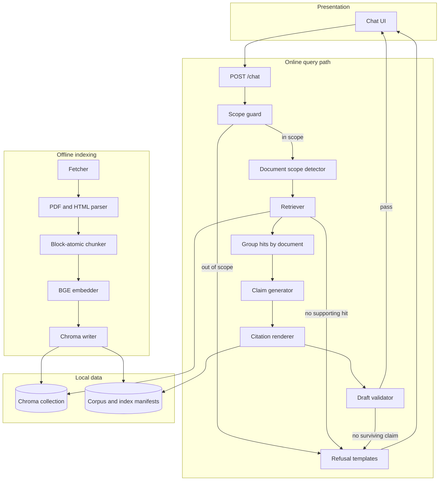
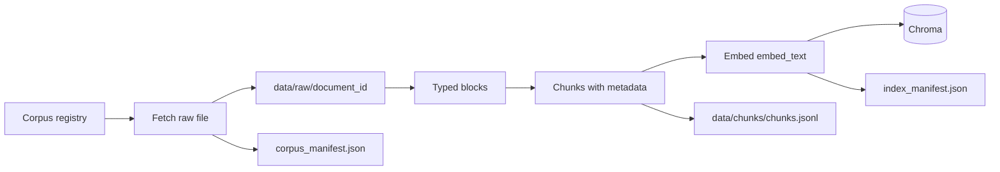
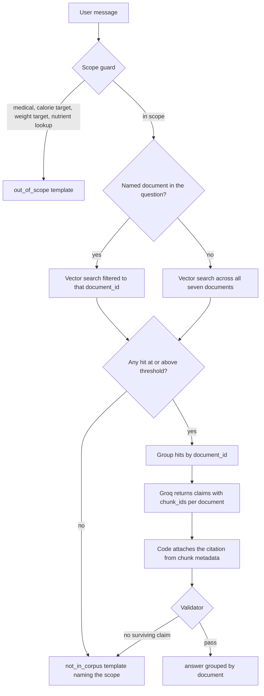

# Architecture: Dietary Guidance RAG Chatbot

This document is the build design for the prototype in [problemStatement.md](./problemStatement.md). The assistant answers questions about food, nutrition, and food safety from seven official public guidance documents. Every claim carries a citation the application fills from chunk metadata. Questions the guidance does not cover, and questions that are out of scope by design, are declined by code.

**Stack.** Python application. **Groq** writes claim text. **BGE** (`BAAI/bge-small-en-v1.5`) embeds locally. **Chroma** holds the vector index. A rule-based guard runs before retrieval and before any model call. A second check runs on the draft before it is returned.

---

## 1. What the architecture guarantees

Each constraint in the problem statement is owned by a specific part of the system.

| Constraint | Owner | What it does |
| --- | --- | --- |
| Grounding | Retriever and generator | The model receives the retrieved chunk text for that question. |
| Citations | Citation renderer | Application code writes document name, publisher, year, and source URL from chunk metadata. |
| Provenance | Fetcher and corpus manifest | Every stored document records publisher, year, source URL, and retrieval date. |
| Chunk identity | Chunker | Every chunk records document name, publisher, year, and section heading. |
| Structure | Parser and chunker | A table row and a numbered recommendation stay inside one chunk. |
| Separation of authorities | Grouping step and generator | Hits are grouped by document. The model writes one section per document. A claim cites one document. |
| Refusal in code | Scope guard | Medical advice, personal calorie targets, and personal weight targets are refused before retrieval. The generator is called only for questions the guard has passed. |
| Corpus size | Corpus registry | The allowlist is the seven documents in the problem statement. Fetch, filtered retrieval, and citations all read that list. |

Per-food nutrient numbers stay outside this service. They belong to the structured database in Milestone 3. The guard refuses a nutrient lookup before any chunk is retrieved, so a number that happens to appear in a guidance document cannot become an answer to that question.

---

## 2. System context

This prototype is the first service in a larger product. It answers two families of questions from written guidance:

- Is this a reasonable way to eat?
- How long can I keep this in the fridge?

The person using it wants an answer they can check against a named public document. The service reads official guidance to them. It is a reader of those documents, and the product boundary says so in the disclaimer and in the out-of-scope path.

Three results are possible, and they are different response types:

1. `answer` — claims drawn from retrieved passages, each with a citation.
2. `not_in_corpus` — the question is in scope, and the retrieved guidance does not cover it. The reply names what was searched.
3. `out_of_scope` — the question is blocked by design. The reply declines and points the person to a qualified professional.

When two authorities both speak to a topic, the person sees two sections. Cooking oil is the example already named in the problem statement: nutrition documents discuss fats and oils, and food-safety documents discuss storage, chilling, and leftovers.

---

## 3. Corpus

The index is built from the seven documents in the problem statement. A corpus registry in code is the allowlist.

| `document_id` | Document | Publisher | Year | Kind | Source URL |
| --- | --- | --- | --- | --- | --- |
| `cold-food-storage` | Cold Food Storage Chart | FoodSafety.gov (U.S. Department of Health and Human Services / FDA / USDA) | 2023 | Food safety. Mostly one table. | https://www.foodsafety.gov/food-safety-charts/cold-food-storage-charts |
| `who-healthy-diet` | Healthy diet (Fact sheet) | World Health Organization | 2018 | Nutrition. Direct PDF. | https://www.who.int/docs/default-source/healthy-diet/healthy-diet-fact-sheet-394.pdf |
| `fao-who-healthy-diets` | What are healthy diets? Joint statement | Food and Agriculture Organization of the United Nations and World Health Organization | 2024 | Nutrition. Publication page; the fetcher follows the English PDF. | https://www.who.int/publications/i/item/9789240101876 |
| `who-five-keys` | Five keys to safer food manual | World Health Organization | 2006 | Food safety. Publication page; the fetcher follows the English PDF. | https://www.who.int/publications/i/item/9789241594639 |
| `eatwell-guide` | The Eatwell Guide booklet | Public Health England (now Office for Health Improvement and Disparities) | 2018 | Nutrition. Direct PDF. | https://assets.publishing.service.gov.uk/media/5ba8a50540f0b605084c9501/Eatwell_Guide_booklet_2018v4.pdf |
| `fsa-chill` | How to chill, freeze and defrost food safely | Food Standards Agency (UK) | 2017 | Food safety. HTML guidance page. | https://www.gov.uk/government/publications/how-to-chill-freeze-and-defrost-food-safely/how-to-chill-freeze-and-defrost-food-safely |
| `kitchen-companion` | Kitchen Companion: Your Safe Food Handbook | USDA Food Safety and Inspection Service | 2008 | Food safety. Direct PDF. | https://www.fsis.usda.gov/sites/default/files/media_file/2020-12/Kitchen-Companion.pdf |

Three documents are nutrition guidance: Healthy diet, What are healthy diets?, and the Eatwell Guide. Four are food-safety guidance: the Cold Food Storage Chart, Five keys to safer food, How to chill, freeze and defrost food safely, and Kitchen Companion.

Each registry entry also stores:

- `retrieval_date`, filled when that file is downloaded.
- `aliases`, used to detect “answer from this document”. Examples: `eatwell`, `eatwell guide`, `kitchen companion`, `five keys`, `cold food storage`.
- `landing_page`, true for the two WHO publication pages. The citation link stays the publication URL. The bytes stored on disk are the English PDF linked from that page.

`cold-food-storage` and `fsa-chill` are HTML. The other five entries are stored as PDF. Several hosts refuse clients that omit a browser User-Agent, so the fetcher sends one.

These documents are written prose (and the tables inside that prose). None of them is a nutrient database with a clean API. That is the boundary with Milestone 3.

---

## 4. Runtime shape



Two paths, and they do not share a request:

1. **Offline indexing** runs when the corpus is built or refreshed. It fetches, parses, chunks, embeds, and writes the index. It does not run while a person is waiting for an answer.
2. **Online answering** classifies the question in code, retrieves, asks the model for claims tied to chunk ids, then renders citations and checks the draft in code.

---

## 5. Offline indexing



### 5.1 Fetch

For each registry row the fetcher:

1. Requests the source URL with a browser User-Agent.
2. When `landing_page` is set, follows the English PDF link on that page and stores the PDF. The citation URL remains the registry `source_url`.
3. Writes the bytes to `data/raw/<document_id>/source.pdf` or `source.html`.
4. Records `retrieval_date` (UTC date), content hash, HTTP status, content type, and the final download URL in `data/corpus_manifest.json`.

A later run skips a row whose hash is unchanged. A failed download leaves the previous file in place and marks the row `stale`. The indexer refuses to publish an index while any allowlisted document is missing or stale, so a partial corpus cannot be served as if it were the full seven.

### 5.2 Parse into typed blocks

The parser emits a sequence of blocks. A block has a type, text, and the heading path above it.

| Block type | Produced from | Rule |
| --- | --- | --- |
| `heading` | PDF outline or font size, HTML `h1`–`h3` | Updates the heading path. A heading is metadata for the blocks under it. |
| `paragraph` | Body prose | Kept whole. |
| `list_item` | Numbered or bulleted recommendation | Kept whole, including its number. |
| `table` | PDF table extraction or an HTML table | Kept as a markdown table. The header row is stored so it can be repeated onto each row chunk. |

PDF prose and PDF tables are extracted on separate passes. Reading-order text that is only the flattened table is dropped, so the same grid is indexed once. HTML pages use the same block types. Cookie banners, navigation, and “is this page useful” prompts are stripped before chunking.

The Cold Food Storage Chart is the structural test named in the problem statement. It is one table: food, type, refrigerator time, freezer time. Each data row becomes a block whose text includes the column headers:

```text
Food: Poultry | Type: Chicken or turkey, whole | Refrigerator (40°F / 4°C or below): 1 to 2 days | Freezer (0°F / -18°C or below): 1 year
```

That row is the unit a question such as “how long can I keep a whole chicken in the fridge” must retrieve intact. Refrigerator time and freezer time stay in the same chunk.

### 5.3 Chunking

**Chosen strategy: block-atomic chunks under a heading.**

The pack target is 200 estimated tokens (`round(word_count × 1.3)`), set from `data/parsed/blocks.jsonl` in the implementation plan. Parsed paragraphs are line fragments: 1,121 of them, median 16 tokens, longest 162. An 800-token cap and a 50-token overlap do not apply to this corpus.

A chunk is one of:

- one `list_item`, so a numbered recommendation stays with its number and its section heading
- one table row, with the header line included in the chunk text
- one or more consecutive `paragraph` blocks under the same heading, packed toward 200 tokens, breaking only between paragraphs

A chunk is cut on a sentence boundary only when a single paragraph exceeds 200 tokens. Both pieces keep the same heading path. The pieces do not overlap. No paragraph in the parsed corpus exceeds 200 tokens. A numbered item and a table row are never split. The Cold Food Storage chart is one grid of about 1,375 tokens and 53 data rows; each labeled row is 30–56 tokens, so the row is what fits the 512-token model window.

Every chunk carries:

| Field | Source |
| --- | --- |
| `chunk_id` | Stable id, `{document_id}:{ordinal}` |
| `document_id` | Registry slug |
| `document_name` | Registry title |
| `publisher` | Registry publisher |
| `year` | Registry year |
| `source_url` | Registry URL, the link a citation will show |
| `retrieval_date` | Manifest date for that file |
| `section_heading` | Heading path, joined with ` > ` |
| `block_type` | `paragraph`, `list_item`, or `table_row` |
| `text` | The passage shown to the model and cited |
| `embed_text` | `{document_name} — {section_heading}\n{text}` |

`embed_text` is what BGE embeds. The document name and section heading are prefixed so a short row such as “1 to 2 days” is distinguishable from a similar row in another handbook. Filtering still uses `document_id` metadata. The prefix is there for the vector.

**Cost of this method.** The README states this tradeoff:

- Chunks are uneven. A storage-chart row is a few dozen tokens. A packed section is at most 200 estimated tokens, and most heading runs are already under that (median 48). Short rows and short list items embed with less distinctive context than a packed window, which is why the prefix and the metadata filter exist.
- The parser has a case for PDF tables and a case for HTML tables. A new document format needs a parser case.
- Parent-section prose lives in the heading path and the embed prefix. A chunk carries its section heading, and it does not repeat the whole parent section.

Fixed-size token windows are the wrong tool for this corpus. They split refrigerator and freezer columns apart, and they cut numbered recommendations in half. That is the failure the problem statement calls out.

### 5.4 Embed and index

- Model: `BAAI/bge-small-en-v1.5`, run locally. Queries are prefixed with the BGE instruction `Represent this sentence for searching relevant passages: `. Chunk `embed_text` is embedded as stored. The built chunk file confirms this window: table rows top out at 88 of this model’s tokens, list items at 230, and the fats guidance in the WHO fact sheet at 259. A 256-token model would cut that fats passage. One Five Keys evaluation-form paragraph is 1,741 tokens of underscore blanks and is dropped rather than used as a reason to change models. The implementation plan records the counts.
- Metric: cosine similarity on L2-normalised vectors.
- Store: one persistent Chroma collection under `data/index/`.
- Each record stores `text` as the document body. Metadata holds `document_id`, `document_name`, `publisher`, `year`, `source_url`, `section_heading`, `block_type`, and `retrieval_date`, so filtered search and citation rendering read the hit itself.
- `data/chunks/chunks.jsonl` is the readable copy of every chunk, used by tests and by a rebuild.
- `data/index/index_manifest.json` records the model name, chunk count, a fingerprint of `chunks.jsonl`, and `embedded_at`. A rebuild is skipped when the fingerprint matches.

The collection is small. Seven documents fit in one collection and one process.

---

## 6. Online query path



### 6.1 Scope guard

The guard is deterministic code on the raw user message. It runs before retrieval and before Groq. A match returns immediately with `type: "out_of_scope"`.

| Reason code | What it catches | Reply |
| --- | --- | --- |
| `medical` | Diagnosis, symptoms, medicines, treatment, “I have [condition]”, whether a food is safe for a stated illness | Decline, and point the person to a qualified professional. |
| `calorie_target` | How many calories the person should eat, a deficit, a personal calorie goal | Decline, and point the person to a qualified professional. |
| `weight_target` | What the person should weigh, an ideal weight, a personal weight goal | Decline, and point the person to a qualified professional. |
| `nutrient_lookup` | Calories, protein, or another nutrient amount in a named food | Decline. Say this assistant answers from dietary guidance documents and does not look up nutrient numbers for individual foods. |

Population guidance that the documents themselves state stays in scope. “What does WHO say about limiting free sugars?” and “What does the guidance say about salt?” are questions about the documents, and the answer is a cited claim. The guard is aimed at a personal target or a per-food composition number, which it detects from the question wording.

The patterns live in one module and are covered by unit tests. A prompt instruction is a reminder to the model. The enforcement is the guard.

### 6.2 Document scope detector

After the guard, the detector sets the retrieval scope. This is the two-mode requirement.

- If the message names one corpus document through its aliases, `document_id` is set and retrieval is filtered to that id. On a miss, the searched set is that one document.
- Otherwise retrieval runs across the whole collection. The searched set is all seven document names.

The UI can also send `document_id` explicitly. An explicit id overrides alias detection. An id outside the registry is rejected before retrieval.

### 6.3 Retriever

1. Embed the query with the BGE query prefix.
2. Query Chroma for the top neighbours. Start with `k = 8` across the corpus and `k = 5` when filtered to one document.
3. When `document_id` is set, pass it as a metadata filter so other documents cannot appear in the hit list.
4. Drop hits below `MIN_SIMILARITY`. Set the starting threshold on a small evaluation set of in-corpus questions and deliberate misses, and record the chosen value in the README.
5. Inside an unfiltered search, keep at most three chunks per document so one long handbook cannot crowd out a second authority.
6. If the kept list is empty, return `not_in_corpus` without calling Groq. The refusal names every document in the searched set: name, publisher, and year.

Hits that survive are grouped by `document_id`. A document with no surviving hit is omitted from the prompt.

### 6.4 Claim generator

Groq receives the question and the grouped chunks. Temperature is 0. It returns JSON:

```json
{
  "documents": [
    {
      "document_id": "who-healthy-diet",
      "claims": [
        {
          "text": "Intake of saturated fats should be less than 10% of total energy intake.",
          "chunk_ids": ["who-healthy-diet:12"]
        }
      ]
    }
  ]
}
```

The system prompt states three rules the validator also enforces:

- A claim’s `chunk_ids` are chosen from the ids in that document’s group.
- A claim states what that document’s chunks say.
- An empty `claims` list means that document does not answer the question.

The application writes the citation line from the chunk record. The model has no field for publisher or URL, so it cannot invent either.

### 6.5 Citation renderer

For each surviving claim the renderer emits the claim, then the citation:

```text
Intake of saturated fats should be less than 10% of total energy intake.
— Healthy diet (Fact sheet), World Health Organization, 2018
  https://www.who.int/docs/default-source/healthy-diet/healthy-diet-fact-sheet-394.pdf
```

A citation is document name, publisher, year, and source URL. The section heading is available on the chunk and can be shown with the citation so a reader can find the passage inside the document.

Sections follow corpus-registry order, so the same question lays out the same way each time. The section heading is the document name. Two documents produce two sections. One document produces one section.

### 6.6 Validator

A claim is dropped when any of these fail:

- `chunk_id` was absent from the retrieval set for that `document_id`
- the claim text is empty
- the claim is unsupported by the cited chunk: every number in the claim appears in the chunk, and at least half of the claim’s content words appear there too
- the citation URL differs from the allowlisted `source_url` for that `document_id`
- the claim text matches the medical, calorie-target, or weight-target patterns, so a document that mentions weight cannot license a personal target in the answer

If every claim is dropped, the response becomes `not_in_corpus` and names the searched set. If at least one claim remains, the response is `type: "answer"`.

Groq errors and quota failures return a separate template, `generation_unavailable`. That template says the answer could not be generated. It does not say the guidance was searched and found empty.

---

## 7. Cross-document answers

Some questions are covered by more than one authority. Cooking oil is the example in the problem statement. Nutrition documents discuss fats and oils as part of a dietary pattern. Food-safety documents discuss storage, chilling, and handling.

The pipeline already groups by `document_id`, so a cross-document question is the ordinary path with two or more groups:

```text
According to Healthy diet (Fact sheet) — World Health Organization, 2018
  <claim>
  — Healthy diet (Fact sheet), World Health Organization, 2018
    <source url>

According to Kitchen Companion: Your Safe Food Handbook — USDA Food Safety and Inspection Service, 2008
  <claim>
  — Kitchen Companion: Your Safe Food Handbook, USDA Food Safety and Inspection Service, 2008
    <source url>
```

There is no step that merges those sections into a sentence about what “the guidelines say”. If the two documents speak to different aspects, both sections stand. If they differ, both sections stand. A filtered query returns at most one section, because the retriever never received the other documents.

---

## 8. The two refusals

They are different response types, different templates, and different points in the pipeline.

### 8.1 Not in the corpus

`type: "not_in_corpus"` is used when the question is in scope and the retrieved chunks do not contain the answer. That happens when the hit list is empty, or when the validator drops every claim.

The template:

- says the guidance documents searched do not cover the question
- lists the searched documents by name, publisher, and year
- on a filtered query, lists only the one document that was searched

Whole corpus, nothing relevant:

```text
The guidance I searched does not cover that.
I searched:
- Cold Food Storage Chart, FoodSafety.gov (U.S. Department of Health and Human Services / FDA / USDA), 2023
- Healthy diet (Fact sheet), World Health Organization, 2018
- What are healthy diets? Joint statement, Food and Agriculture Organization of the United Nations and World Health Organization, 2024
- Five keys to safer food manual, World Health Organization, 2006
- The Eatwell Guide booklet, Public Health England (now Office for Health Improvement and Disparities), 2018
- How to chill, freeze and defrost food safely, Food Standards Agency (UK), 2017
- Kitchen Companion: Your Safe Food Handbook, USDA Food Safety and Inspection Service, 2008
```

### 8.2 Out of scope by design

`type: "out_of_scope"` is used when the scope guard matches, before retrieval. The template declines and points the person to a qualified professional. It does not list the corpus. The corpus was not consulted, and a corpus hit would not make the question acceptable.

```text
I can’t help with medical advice or with personal calorie or weight targets.
Please speak with a qualified health professional.
```

A nutrient lookup uses the same response type and its own sentence: this assistant answers from dietary guidance documents and does not look up nutrient numbers for individual foods. That matches the behaviour table. Composition data is Milestone 3, and this prototype leaves it unanswered.

---

## 9. API and UI

### `POST /chat`

```json
{
  "message": "How long can I keep cooked rice in the fridge?",
  "document_id": null
}
```

`document_id` is optional. When it is set, it must be one of the seven registry ids.

**Answer**

```json
{
  "type": "answer",
  "sections": [
    {
      "document_id": "cold-food-storage",
      "document_name": "Cold Food Storage Chart",
      "publisher": "FoodSafety.gov (U.S. Department of Health and Human Services / FDA / USDA)",
      "year": 2023,
      "source_url": "https://www.foodsafety.gov/food-safety-charts/cold-food-storage-charts",
      "claims": [
        {
          "text": "Cooked rice keeps 4 to 6 days in the refrigerator.",
          "chunk_ids": ["cold-food-storage:18"],
          "section_heading": "Cold Food Storage Chart"
        }
      ]
    }
  ],
  "searched": [
    {
      "document_id": "cold-food-storage",
      "document_name": "Cold Food Storage Chart",
      "publisher": "FoodSafety.gov (U.S. Department of Health and Human Services / FDA / USDA)",
      "year": 2023
    }
  ]
}
```

`searched` is the scope of the query on every in-scope response, so the UI can show the boundary. On `not_in_corpus`, `sections` is empty and `searched` is the list the template names. On `out_of_scope`, `searched` is empty because retrieval did not run. On an unfiltered `answer`, `searched` lists all seven documents, and `sections` lists only the documents that produced a surviving claim.

**Refusals**

```json
{
  "type": "not_in_corpus",
  "reason": "no_supporting_chunks",
  "message": "The guidance I searched does not cover that.",
  "sections": [],
  "searched": []
}
```

```json
{
  "type": "out_of_scope",
  "reason": "weight_target",
  "message": "I can’t help with medical advice or with personal calorie or weight targets. Please speak with a qualified health professional.",
  "sections": [],
  "searched": []
}
```

```json
{
  "type": "generation_unavailable",
  "reason": "model_error",
  "message": "I couldn’t generate an answer just now. Please try again.",
  "sections": [],
  "searched": []
}
```

### UI

A single chat page:

- A disclaimer that answers come from the seven official guidance documents, and that this is a reading of those documents.
- An optional document picker whose values are the seven `document_id`s. Empty means search all.
- Each answer rendered as one block per document, with the citation under each claim.
- The two refusal states rendered so “the guidance does not cover this” and “out of scope” look different.
- Example prompts for a fridge-time question, a cooking-oil question, a question limited to one named document, and a weight-target question that demonstrates the out-of-scope refusal.

---

## 10. Module layout

```text
src/constants.py              corpus registry, chunk limits, retrieval thresholds, BGE model name
src/ingestion/fetcher.py      download, landing-page PDF follow, corpus_manifest
src/ingestion/parser.py       PDF and HTML to typed blocks
src/ingestion/chunker.py      block-atomic chunks
src/ingestion/indexer.py      BGE embeddings and the Chroma writer
src/ingestion/pipeline.py     fetch, then parse, then chunk, then index
src/rag/classifier.py         scope guard and document-alias detection
src/rag/retriever.py          filtered search and cross-corpus search
src/rag/generator.py          Groq JSON claims
src/rag/citations.py          name, publisher, year, and URL from chunk metadata
src/rag/validator.py          drop unsupported claims and out-of-scope claim text
src/rag/refusal.py            fixed templates for both refusal types
src/rag/pipeline.py           guard, then retrieve, then generate, then cite, then validate
src/api/main.py               POST /chat
src/ui/app.py                 chat page
scripts/build_index.py        offline pipeline entry point
```

Tests that match the acceptance criteria:

| Test | Asserts |
| --- | --- |
| Corpus manifest | Each of the seven documents is stored with publisher, year, source URL, and retrieval date. |
| Chunk metadata | Every chunk has document name, publisher, year, and section heading. |
| Table integrity | A Cold Food Storage row keeps refrigerator time and freezer time in the same chunk. |
| Numbered recommendations | A numbered item keeps its number and is not split across chunks. |
| Filtered retrieval | A query restricted to `eatwell-guide` returns no other `document_id`. |
| Cross-corpus retrieval | A query with no document set can return more than one `document_id`. |
| Citation | Each rendered claim’s URL equals that chunk’s `source_url`, and the citation includes name, publisher, and year. |
| Cross-document shape | A question with two supporting documents yields two sections. The answer text contains no blended “the guidelines say” claim. |
| Not in corpus | An in-scope miss names the searched documents and does not call Groq. |
| Out of scope | A weight-target question returns `out_of_scope` and does not call the retriever. |
| Nutrient lookup | “protein in 100 g of chicken” returns `out_of_scope` with reason `nutrient_lookup`. |

---

## 11. Worked paths

These are the rows of the behaviour table, traced through the pipeline.

**One document covers the question.** “How long can I keep a whole chicken in the fridge?” passes the guard, searches all documents, and retrieves the poultry row of the Cold Food Storage Chart. The answer is one section. The claim cites Cold Food Storage Chart, FoodSafety.gov, 2023, and the chart URL. Refrigerator time and freezer time come from the same chunk.

**Two documents cover the question.** “What do the documents say about cooking oil?” passes the guard. Nutrition chunks from the WHO fact sheet, the FAO/WHO joint statement, and the Eatwell Guide are grouped separately from any food-safety chunks that mention oils, fats, storage, or leftovers. The answer is one section per document that produced a surviving claim. Each section has its own citations. There is no sentence that attributes one oil recommendation to “the guidelines”.

**Filtered to one named document.** “According to the Eatwell Guide, how much of the diet should be fruit and vegetables?” sets `document_id` to `eatwell-guide`. Other documents are excluded by the metadata filter. A miss names only the Eatwell Guide.

**Retrieved chunks do not contain the answer.** “What is the tariff on imported olive oil?” passes the guard, retrieves nothing above the threshold, and returns `not_in_corpus` with all seven documents listed. Groq is not called.

**Out of scope by design.** “What should I weigh?” matches `weight_target` in the classifier. The retriever and Groq are not called. The reply points to a qualified professional. “How many calories should I eat to lose weight?” follows the same path with `calorie_target`. “Is this chest pain from something I ate?” follows it with `medical`.

**Nutrient numbers.** “How much protein is in 100 g of chicken?” matches `nutrient_lookup`. The reply says this assistant answers from dietary guidance and does not look up nutrient numbers for individual foods. The corpus is not searched.

---

## 12. Operational notes

- Secrets: `GROQ_API_KEY` in the environment. The embedding model and the index are local.
- Rebuild: `python -m scripts.build_index` runs the offline pipeline. The chat path reads the index.
- Logging: log the document scope, the hit count, and the refusal reason code. After validation, log reason codes for dropped claims. Leave the raw model JSON out of the log once claims have been dropped.
- The index is seven documents. One Chroma collection and a single-process API are enough for the prototype.

The prototype is doing its job when a reader can check every sentence of an answer against a named public document, or can see a precise reason the assistant will not answer.
