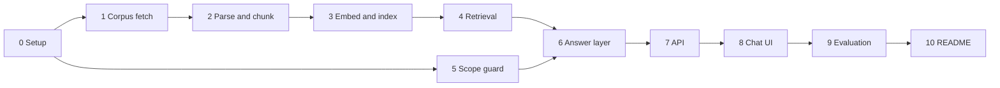

# Phase-Wise Implementation Plan

This plan builds the dietary guidance RAG chatbot in [problemStatement.md](./problemStatement.md) and [architecture.md](./architecture.md). Each phase has a goal, tasks, deliverables, and exit criteria. A later phase starts after the previous phase's exit criteria pass.

**Stack:** Python 3.11+ · Groq for claim text · BGE (`BAAI/bge-small-en-v1.5`) for local embeddings · Chroma for the vector index · FastAPI for `POST /chat` · Streamlit for the chat page.

---

## Overview

| Phase | Name | Primary output | Satisfies |
| --- | --- | --- | --- |
| 0 | Project setup | Registry, dependencies, layout | Architecture §3 and §10 |
| 1 | Corpus fetch | Seven raw files and a provenance manifest | Corpus, provenance |
| 2 | Parse and chunk | Block-atomic chunks with section headings | Chunking, chunk identity, structure |
| 3 | Embed and index | Chroma collection | Retrieval store |
| 4 | Retrieval | Cross-corpus and single-document search | Two retrieval modes |
| 5 | Scope guard | Code refusals before retrieval | Out of scope by design |
| 6 | Answer layer | Cited, per-document claims, and the not-in-corpus refusal | Answer layer, cross-document questions |
| 7 | Chat API | `POST /chat` | Architecture §9 |
| 8 | Chat UI | Per-document answers and two refusal styles | Architecture §9 |
| 9 | Evaluation | The worked paths in architecture §11 | Behaviour table and acceptance criteria |
| 10 | README | How to run it, and the chunking tradeoff | README requirement |

Phases 4 and 5 can be built in either order once phase 0 is done. Phase 5 does not need the index. Phase 6 needs both.

---

## Phase 0: Project setup

**Goal:** A runnable skeleton whose corpus registry is the single allowlist for fetch, filter, and citation (architecture §3).

### Tasks

1. Create the layout from architecture §10:
   - `src/ingestion/`, `src/rag/`, `src/api/`, `src/ui/`
   - `scripts/`, `tests/`, `tests/fixtures/`
   - `data/raw/`, `data/chunks/`, `data/index/`
2. Add `requirements.txt`:
   - `fastapi`, `uvicorn`, `pydantic`, `python-dotenv`
   - `httpx`, `beautifulsoup4`
   - `pymupdf`, `pdfplumber` (text layer and tables)
   - `chromadb`, `sentence-transformers`
   - `groq`
   - `streamlit`
   - `pytest`
3. Add `src/constants.py` with one frozen record per document from architecture §3:
   - `document_id`, `document_name`, `publisher`, `year`, `source_url`
   - `kind`: `html` for `cold-food-storage` and `fsa-chill`; `pdf` for the other five
   - `landing_page`: true for `fao-who-healthy-diets` and `who-five-keys`
   - `aliases` for “answer from this document”, including `eatwell`, `eatwell guide`, `kitchen companion`, `five keys`, `cold food storage`, `healthy diet`, `food standards agency`
4. Add the indexing and retrieval constants. Paragraph packing uses the target phase 2 measured on `data/parsed/blocks.jsonl`. Retrieval constants are architecture §6.3:
   - `CHUNK_TARGET_TOKENS = 200`
   - `TOP_K_ALL = 8`
   - `TOP_K_FILTERED = 5`
   - `MAX_CHUNKS_PER_DOCUMENT = 3`
   - `CANDIDATE_K = 24` (three chunks per document, times eight kept)
   - `MIN_SIMILARITY = 0.45` as a placeholder. Phase 4 replaces it after probes against the built index.
   - `BGE_MODEL_NAME = "BAAI/bge-small-en-v1.5"`
   - `BGE_QUERY_PREFIX = "Represent this sentence for searching relevant passages: "`
   - `GROQ_DEFAULT_MODEL`, `GROQ_TEMPERATURE = 0.0`, `GROQ_MAX_TOKENS = 1024`
   - `MIN_CLAIM_TERM_OVERLAP = 0.5`
5. Add `.env.example` with `GROQ_API_KEY` and `GROQ_MODEL`. Add `.gitignore` for `.env`, `data/raw/`, `data/chunks/`, `data/index/`, and `__pycache__/`.
6. Add package `__init__.py` files and a `scripts/build_index.py` stub that exits with a clear “not implemented” message until phase 3.

### Deliverables

- [ ] A virtualenv installs from `requirements.txt`
- [ ] The registry lists exactly the seven `document_id`s in architecture §3
- [ ] `scripts/build_index.py` exists and exits with a clear message until phase 3

### Exit criteria

- `python -c "from src.constants import CORPUS; assert len(CORPUS) == 7"` succeeds
- Every `source_url` in the registry appears in the problem-statement corpus table
- `landing_page` is true only for the two WHO publication pages

---

## Phase 1: Corpus fetch

**Goal:** Download the seven documents and store publisher, year, source URL, and retrieval date with each file.

### Tasks

1. Implement `src/ingestion/fetcher.py`.
   - Request each registry URL with a browser User-Agent. Several of these hosts refuse clients that omit one.
   - Follow redirects and record the final URL.
   - Write bytes to `data/raw/<document_id>/source.pdf` or `source.html`, matching `kind`.
   - When `landing_page` is true, the registry URL is a publication page. Follow the English PDF link on that page and store the PDF. The citation URL stays `source_url`. Record the asset URL separately as `downloaded_url`.
2. Write `data/corpus_manifest.json` with one row per document:
   - `document_id`, `document_name`, `publisher`, `year`
   - `source_url`, `downloaded_url`, `retrieval_date` (UTC date)
   - `sha256`, `http_status`, `content_type`
   - `status`: `ok` or `stale`
   - `file`: the path under `data/raw/`
3. On a later run, skip a document whose hash is unchanged. On a failed download, keep the previous file and set `status` to `stale`.
4. Add `tests/test_fetcher.py` with saved HTML and PDF fixtures and a mocked HTTP client. Unit tests do not hit the network. Cover:
   - a direct PDF
   - an HTML page
   - a landing page that links to an English PDF, with `source_url` unchanged and `downloaded_url` set to the PDF
   - a failed download that leaves previous bytes in place and marks the row `stale`
   - an unchanged hash that does not rewrite the file

### Deliverables

- [ ] `data/raw/` contains seven source files after a real fetch
- [ ] `data/corpus_manifest.json` has publisher, year, source URL, and retrieval date for each
- [ ] Fetcher unit tests pass offline

### Exit criteria

- A fresh network run leaves seven `status: ok` rows, or it stops with a named `document_id` rather than continuing toward an index of a partial corpus
- Re-running with unchanged files does not rewrite those files
- A simulated failed download leaves the previous bytes in place and marks that row `stale`
- The two landing-page documents are stored as PDFs, and their manifest `source_url` is still the publication page

---

## Phase 2: Parse and chunk

**Goal:** Turn each raw file into block-atomic chunks. Every chunk carries document name, publisher, year, and section heading. A table row and a numbered recommendation stay whole (architecture §5.2). Paragraphs pack toward 200 tokens, the target measured below. Architecture §5.3 records the same rule.

**Measured from `data/parsed/blocks.jsonl` (1,789 blocks).** Tokens are `round(word_count × 1.3)`.

| Block | Count | Median tokens | Max tokens | What chunking does with it |
| --- | --- | --- | --- | --- |
| `paragraph` | 1,121 | 16 | 162 | Line fragments. 1,104 of them (98%) are under 30 tokens. None reach 400, so an 800-token split and a 50-token overlap never fire. |
| `list_item` | 446 | 22 | 192 | One chunk each. 88 items are under 10 tokens. |
| `table` | 8 grids, 115 data rows | 30–39 on the storage charts | 61 per labeled row | Cold Food Storage is one grid of 1,375 tokens and 53 rows. A labeled row is 30–56 tokens. The grid does not fit the 512-token model window. |
| `heading` | 214 | 4 | 18 | Metadata only. Not a chunk. |

Consecutive paragraphs that share a heading: 169 runs, median 48 tokens. 142 runs are at or under 200 tokens. 27 exceed 200. 11 exceed 400. Two exceed 800: the FAO/WHO title section (1,077 tokens across 59 lines, including licence text) and Eatwell “8 tips for eating well” (867 tokens across 65 lines). A pack target of 200 keeps those 142 sections as one chunk and splits only the long runs. A target of 400 would leave just 11 more runs whole, and those 11 are the runs that mix many lines under one heading. A 200-token body plus the embed prefix (document name and a heading path of about 14 words) stays inside the 512-token window.

### Tasks

1. Implement `src/ingestion/parser.py`. Emit a sequence of blocks. Each block has `type`, `text`, and `heading_path`.
   - `heading` updates the heading path. It is metadata for the blocks under it, and it is not itself a chunk.
   - `paragraph` is one line of body prose from the text layer, kept whole. These are fragments, not 400-token passages.
   - `list_item` is a numbered or bulleted recommendation, kept whole, including its number.
   - `table` is a markdown table. Store the header row separately so each row chunk can repeat it.
   - PDF: extract headings from the outline or font size, and prose from the text layer. Extract tables with a table extractor on a separate pass. Drop reading-order text that only repeats a table already extracted, so the same grid is indexed once.
   - HTML: map `h1`–`h3` to headings, paragraphs to `paragraph`, `ol`/`ul` items to `list_item`, and tables to `table`. Strip navigation, cookie banners, and feedback widgets before chunking.
   - Write `data/parsed/blocks.jsonl` so the chunker and the tests can run without re-parsing.
2. Implement `src/ingestion/chunker.py`. Estimate tokens as `round(word_count × 1.3)` so chunking does not load BGE.
   - **Paragraphs.** Pack consecutive paragraphs that share a heading path toward 200 tokens. Break only between paragraphs, when the next paragraph would pass 200. Do not cut a paragraph to hit the target. A single paragraph over 200 tokens is not in this corpus (the longest is 162). If one appears, split it on sentence boundaries and give both pieces the same heading path. Do not overlap the pieces. Overlap would repeat a sentence that already fits in one chunk. If that paragraph has no sentence boundary, stop the build and name the block.
   - **List items.** One chunk per `list_item`. The number stays with the item. A list item is never split and never merged with another item, including an item of one or two words.
   - **Tables.** One chunk per data row. The chunk text includes the column headers, for example `Food: Fresh poultry | Type: Chicken or turkey, whole | Refrigerator [40°F (4°C) or below]: 1 to 2 days | Freezer [0°F (-18°C) or below]: 1 year`. A row is never split. Index the rows, not the whole grid as well. Cold Food Storage yields 53 row chunks. A row chunk repeats the cells the parser stored. It does not invent a category the parser dropped: Kitchen Companion’s cold-storage grid has continuation rows such as “Opened package” with no food group on that row.
   - Set `chunk_id` to `{document_id}:{ordinal}` over chunks, not blocks.
   - Fields on every chunk: `document_id`, `document_name`, `publisher`, `year`, `source_url`, `retrieval_date`, `section_heading` (heading path joined with ` > `), `block_type` (`paragraph`, `list_item`, or `table_row`), `text`, `embed_text`.
   - `embed_text` is `{document_name} — {section_heading}\n{text}`.
3. Write chunks to `data/chunks/chunks.jsonl`.
4. Add tests against fixtures, including a small Cold Food Storage table fixture and a numbered-list fixture:
   - Every chunk has document name, publisher, year, and a non-empty section heading.
   - A Cold Food Storage row contains that row’s refrigerator value and freezer value, and does not contain a different food’s row. The whole-chicken row contains “1 to 2 days” and “1 year”.
   - A numbered recommendation keeps its number inside one chunk.
   - Consecutive short paragraphs under one heading whose token sum exceeds 200 break between paragraphs. No pack exceeds 200 estimated tokens unless it is a single paragraph.
   - A synthetic paragraph over 200 tokens is split on a sentence boundary. Both chunks share `section_heading`. The second chunk does not repeat the tail of the first.
   - No heading block is emitted as a chunk.
   - `embed_text` starts with the document name.
   - `source_url` on every chunk equals the registry URL for that `document_id`.

### Deliverables

- [ ] `data/parsed/blocks.jsonl` and `data/chunks/chunks.jsonl` for all seven documents
- [ ] Parser and chunker tests pass
- [ ] A short note, carried into the README in phase 10, stating the choice and its cost: line fragments packed to 200 tokens under a heading, list items and table rows left short on purpose, a parser case per format, and section context carried in the heading and in `embed_text`

### Exit criteria

- Chunk JSONL covers all seven `document_id`s
- Cold Food Storage contributes one row chunk per data row (53), and each row that had both a refrigerator value and a freezer value still has both
- A numbered item is one chunk and still contains its number
- A paragraph pack is at most 200 estimated tokens, unless the pack is one paragraph that itself exceeds 200
- `embed_text` starts with the document name
- No heading block is emitted as a chunk

---

## Phase 3: Embed and index

**Goal:** One persistent Chroma collection over `data/chunks/chunks.jsonl`, embedded with `BAAI/bge-small-en-v1.5` (architecture §5.4). The chunk file decides the model. A 256-token model does not fit the passages the chunker kept, and a longer-context model is not used to keep an evaluation-form blank.

**Measured from `data/chunks/chunks.jsonl`, the file `tests/test_chunker.py` checks.** 777 chunks: 446 `list_item`, 216 `paragraph`, 115 `table_row`. Cold Food Storage contributes 53 `table_row` chunks. Every paragraph pack is at most 200 estimated tokens (`round(word_count × 1.3)`). That estimate is not the model count. The counts below are this model’s wordpiece tokenizer, special tokens included.

| | Chunks | Median tokens | Max tokens |
| --- | --- | --- | --- |
| All `embed_text` | 777 | 60 | 1,741 |
| `table_row` | 115 | 61 | 88 |
| `list_item` | 446 | 55 | 230 |
| `paragraph` | 216 | 90 | 1,741 |
| Document-name and heading prefix | 777 | 29 | 60 |

Six `embed_text` values exceed 256 tokens. One exceeds 512.

| `chunk_id` | Tokens | What it is |
| --- | --- | --- |
| `who-five-keys:79` | 1,741 | Evaluation-form blanks. 1,612 underscore characters. 94 words, so the 200-token estimate did not see it. |
| `kitchen-companion:381` | 357 | Phone numbers, URLs, and an index. Real text. Fits in 512. |
| `fao-who-healthy-diets:29` | 312 | Annex citations and a DOI. Fits in 512. |
| `who-five-keys:81` | 289 | The same form blanks, shorter. Fits in 512. |
| `fao-who-healthy-diets:28` | 262 | Annex definitions and a URL. Fits in 512. |
| `who-healthy-diet:20` | 259 | Fats guidance: saturated fat under 10% of energy, trans-fat under 1%. Fits in 512. |

`who-five-keys:83` (246 tokens) and `who-five-keys:85` are the same blank form and are under 256. The prefix is at most 60 tokens, so it is not what pushes a chunk over the window.

**Model.** Keep `BAAI/bge-small-en-v1.5`. 512-token window, 384 dimensions, cosine, local. Queries take `BGE_QUERY_PREFIX`. Passages are `embed_text` with that prefix left off.

- A 256-token model such as `all-MiniLM-L6-v2` would truncate `who-healthy-diet:20` and the three other guidance chunks at 262, 312, and 357 tokens. Those passages stay whole.
- `bge-base` and `bge-large` use this same tokenizer and the same 512 window. They do not admit the form blank that was dropped. Phase 4 probed the built index: a whole-chicken question still ranks the whole-bird row above the pieces row, and a 20 lb turkey question still ranks the 20–24 lb row first. The model stays `bge-small`.
- A long-context model would embed the underscore run. Drop the form instead.

### Tasks

1. Drop the four Five Keys evaluation-form paragraphs before the first index: `who-five-keys:79`, `who-five-keys:81`, `who-five-keys:83`, and `who-five-keys:85`. The rule is a paragraph whose letters and digits are outnumbered by `_` blank rules. Rewrite `data/chunks/chunks.jsonl`. Do not raise the model window to keep them.
2. Implement `src/ingestion/indexer.py`.
   - Load `BAAI/bge-small-en-v1.5`. Embed `embed_text` only. Leave `BGE_QUERY_PREFIX` off passages.
   - The model window is 512 tokens. Count tokens with this tokenizer, special tokens included. Stop the build before any upsert when a chunk exceeds 512, and name the `chunk_id`. If that happens, fix the chunker before continuing. Do not truncate. On the chunk file measured above, that chunk is `who-five-keys:79` until task 1 has removed it.
   - L2-normalize vectors. Use cosine space. Chroma cosine distance is `1 - similarity`. Phase 4 compares similarity.
   - Id is `chunk_id`. Document body is `text`, the string phase 6 cites.
   - Metadata: `document_id`, `document_name`, `publisher`, `year` (int), `source_url`, `section_heading`, `block_type`, `retrieval_date`. Leave `embed_text` out of metadata.
   - Upsert every row. A later run with the same ids replaces those rows.
3. Write `data/index/index_manifest.json` with model name, dimension (384), max sequence length (512), the observed maximum token count, chunk count, a sha256 fingerprint of `chunk_id + embed_text` in file order, and `embedded_at`. Skip re-embedding when the fingerprint and the model name both match.
4. Implement `src/ingestion/pipeline.py`: fetch, then parse, then chunk, then index. Refuse to publish an index while any corpus-manifest row is missing or `stale`.
5. Wire `scripts/build_index.py` to that pipeline.
6. Add `tests/test_indexer.py` with a temp Chroma directory:
   - Metadata fields round-trip, including `year` as an int and `block_type`.
   - A fixture passage over 512 tokens is rejected, and nothing is upserted.
   - A chunk file that still contains `who-five-keys:79` is rejected by name, and nothing is upserted.
   - The embedder receives `embed_text`, and that string does not start with `BGE_QUERY_PREFIX`.
   - A stale manifest row prevents the index write.
   - `who-healthy-diet:20` is under 512 and is stored whole. Its text still contains both “less than 10%” and “less than 1%”.

### Deliverables

- [ ] `python -m scripts.build_index` builds `data/index/` from the chunk file
- [ ] The index manifest records model, dimension, observed max tokens, chunk count, fingerprint, and timestamp
- [ ] A second run with the same chunks does not re-embed

### Exit criteria

- The four form-blank chunk ids are absent
- Collection count equals the line count of `chunks.jsonl`
- The manifest max token count matches a fresh tokenization of `embed_text` and is at most 512
- A stored Cold Food Storage row returns that row’s refrigerator and freezer text and the registry `source_url`
- Every stored `document_id` is one of the seven registry ids
- `block_type` on a stored row is `paragraph`, `list_item`, or `table_row`

---

## Phase 4: Retrieval

**Goal:** Vector search across all documents, and vector search filtered to one named document (architecture §6.3). The rules below are from the phase 3 collection: 775 chunks, `BAAI/bge-small-en-v1.5`, cosine on L2-normalised vectors. Similarity is the dot product. Chroma’s cosine distance is `1 - similarity`. Compare similarity.

**What is in the collection.** Kitchen Companion is 384 of the 775 chunks. Eatwell Guide 105, Five Keys 92, FAO/WHO healthy diets 58, Cold Food Storage 54 (53 table rows and one intro paragraph), WHO healthy-diet fact sheet 51, FSA Chilling 31. Block types: 446 `list_item`, 214 `paragraph`, 115 `table_row`.

**How close the vectors sit.** Passages are short and often the same shape, so neighbours are close. Nearest other chunk: median cosine 0.919, 90th percentile 0.977, max 1.000. Same-document nearest neighbour median 0.918. Cross-document nearest neighbour median 0.794, max 0.972. The 53 Cold Food Storage rows have a nearest-row median of 0.979.

| Pair | Cosine | Why it matters |
| --- | --- | --- |
| `cold-food-storage:24` and `:25` | 0.992 | Whole chicken or turkey, versus pieces. Fridge time is 1 to 2 days in both. Freezer time is 1 year versus 9 months. |
| `cold-food-storage:24` and `kitchen-companion:69` | 0.953 | The same whole-bird fact in two publishers. |
| `kitchen-companion:192` and neighbouring turkey-size rows | about 0.999 | Oven times differ by bird weight. The text is the only difference. |
| `fao-who-healthy-diets:43` and `:49` | 0.998 | “10 years or older, at least 400 grams per day” versus “at least 25 grams per day”. Different recommendations. |
| `kitchen-companion:60` / `:62`, and `:117` / `:123` | 1.000 | The only two exact duplicate texts in the file. |

Do not drop a neighbour because its cosine to another hit is high. A cutoff at 0.95 would merge whole bird with pieces, and the 400 gram line with the 25 gram line. The chunk text is what distinguishes them. Stay on `bge-small`. These pairs are close, and the queries below still rank the asked row first.

**Probes against this index, 2026-10-03.** Each query was `BGE_QUERY_PREFIX` plus the question, embedded with the model-card query prompt turned off so the prefix is not applied twice. Unfiltered search took the top `CANDIDATE_K` (24), then at most `MAX_CHUNKS_PER_DOCUMENT` (3) per document, then `TOP_K_ALL` (8). Filtered search took `TOP_K_FILTERED` (5) inside that document and did not apply the cap.

| Question | Scope | Top similarity | What the window kept |
| --- | --- | --- | --- |
| How long can I keep a whole chicken in the fridge? | all | 0.811 `kitchen-companion:69` | 16 of the 24 candidates are Kitchen Companion, 8 are Cold Food Storage. After the cap: both whole-bird rows (`kitchen-companion:69` at 0.811, `cold-food-storage:24` at 0.804) and both pieces rows (`:70` at 0.778, `:25` at 0.783). Pieces rank below whole. |
| How long can I keep cooked leftovers in the fridge? | all | 0.845 `kitchen-companion:44` | Four documents inside the 24: Kitchen Companion 17, Cold Food Storage 3, FSA Chilling 3, Five Keys 1. After the cap, Cold Food Storage leftovers (`:51`, cooked meat or poultry, 3 to 4 days) is kept. |
| What do the documents say about cooking oil? | all | 0.665 | `eatwell-guide:71` at 0.662 names vegetable, rapeseed, olive, and sunflower oil. `eatwell-guide:96` at 0.644 says to choose oils high in unsaturated fat. Both are inside the capped 8. This is the weakest in-corpus probe. |
| What does WHO say about saturated fat and trans fat? | all | 0.717 `who-healthy-diet:12` | `:12` contains both “less than 10%” and “less than 1%”. `who-healthy-diet:20` is the same fact at rank 9 and is outside the cap of 3. Do not add a special case to force `:20`. |
| According to the Eatwell Guide, how much of the diet should be fruit and vegetables? | `eatwell-guide` | 0.862 `eatwell-guide:5` | All five hits are `eatwell-guide`, from 0.862 down to 0.791. The top hit is “at least 5 portions”. |
| What is the tariff on imported olive oil? | all | 0.565 `eatwell-guide:30` | The top hit is a saturated-fat paragraph. Nothing in the window is a tariff. |
| How long can raw chicken stay in the fridge? | `eatwell-guide` | 0.572 `eatwell-guide:98` | The top hit is a snack sentence. The Eatwell Guide does not state a fridge time. |

Two windows are filled by one document. “What are the Five Keys to Safer Food?” puts all 24 candidates in `who-five-keys`. The core-messages paragraph `who-five-keys:2` is rank 2 at 0.855, so the cap of 3 keeps it. “How long should I cook a 20 pound turkey?” puts all 24 in `kitchen-companion`, and the 20–24 lb row `kitchen-companion:192` is rank 1 at 0.783. Do not raise `CANDIDATE_K`. A wider window would add more near-duplicate rows from the same handbook, and the cap would discard them.

**Threshold.** Set `MIN_SIMILARITY = 0.62`. The band phase 9 may move inside is **0.58 to 0.64**.

- The placeholder `0.45` keeps the tariff hit at 0.565. It fails the miss probes.
- Both misses top out at 0.572. A floor of 0.58 drops them.
- `eatwell-guide:96` is the oil-label sentence at 0.644. A ceiling of 0.64 keeps it. At 0.66 that sentence drops, while `eatwell-guide:71` at 0.662 would still pass the oil probe. Do not go above 0.64 unless a later probe says the label sentence is not needed.
- 0.62 sits between the miss cluster and that oil sentence. At 0.62 the oil question also keeps two Five Keys lines (0.633 and 0.630) that are not about oil. Move toward 0.64 if those lines produce a bad oil answer. Do not move below 0.58.

Hits equal to the threshold are kept. Hits under it are dropped. The retriever does not delete a Five Keys quiz line that clears the threshold (`who-five-keys:87` scores 0.786 on leftovers). The storage rows are in the same result, and the claim check in phase 6 is what stops a quiz sentence from being stated as guidance.

### Tasks

1. Implement `src/rag/retriever.py`.
   - Load `BAAI/bge-small-en-v1.5` once. Embed `BGE_QUERY_PREFIX + message` with the model-card query prompt turned off, so the prefix is not applied twice. Open the collection so Chroma does not embed the query itself. Pass the vector in.
   - Similarity is `1 - distance`. Compare and report similarity.
   - If the prefixed query exceeds 512 tokens, reject it. Do not truncate the question and search the prefix.
   - Unfiltered: request `CANDIDATE_K` neighbours, drop hits below `MIN_SIMILARITY`, then walk survivors in similarity order, keep at most `MAX_CHUNKS_PER_DOCUMENT` per document, and stop at `TOP_K_ALL`.
   - Filtered: `where={"document_id": document_id}`, request `TOP_K_FILTERED`, drop hits below the threshold, and keep the survivors. The per-document cap applies only to unfiltered search. The cap is there because Kitchen Companion is half the collection and took 16 of 24 slots on the chicken question.
   - Do not collapse near-duplicate rows. Whole bird and pieces both stay when they fall inside the cap. Equal similarity breaks by registry order, then `chunk_id`.
   - Reject a `document_id` outside the registry before querying.
   - Group kept hits by `document_id` in registry order. Each hit carries `chunk_id`, `text`, similarity, and the metadata from phase 3.
   - Return the searched scope (one document, or all seven in registry order), the grouped hits, and the candidate count before the threshold. An empty group list is a valid result. The retriever does not call Groq and does not build refusal text.
2. Add `scripts/probe_retrieval.py`. It takes a question and an optional `document_id`, prints the top candidates with similarity, `chunk_id`, `block_type`, heading, and a short text preview, then prints the grouped result.
3. Set `MIN_SIMILARITY = 0.62` in `src/constants.py`. Comment the date 2026-10-03, the band 0.58–0.64, the tariff top of 0.565, the Eatwell chicken top of 0.572, and `eatwell-guide:96` at 0.644. Leave `TOP_K_ALL`, `TOP_K_FILTERED`, `MAX_CHUNKS_PER_DOCUMENT`, and `CANDIDATE_K` as set in phase 0.
4. Tests against a temp index, plus the real index when `data/index/` exists (skip otherwise):
   - A query filtered to `eatwell-guide` returns only that `document_id`.
   - A `document_id` outside the registry raises before Chroma is called.
   - A query with no filter can return more than one `document_id`, and no document exceeds 3 hits.
   - A fixture hit below 0.62 is absent. A fixture hit at or above 0.62 is present.
   - The embedded query string starts with `BGE_QUERY_PREFIX` and does not contain that prefix twice.
   - On the real index, the tariff question and the chicken question filtered to `eatwell-guide` return an empty group list. The unfiltered chicken question returns `cold-food-storage:24`, and that chunk still contains the refrigerator and freezer times. The leftovers question returns more than one food-safety `document_id`. The oil question returns `eatwell-guide`. The fruit question returns only `eatwell-guide`.

### Deliverables

- [ ] `retrieve(query, document_id=None)` implements both modes
- [ ] `MIN_SIMILARITY` is 0.62, with the band and the bounding scores written next to it
- [ ] `scripts/probe_retrieval.py` prints candidates and the grouped result
- [ ] Retrieval tests pass offline. Real-index tests pass when the index is built

### Exit criteria

- Filtered search cannot return a chunk whose `document_id` differs from the filter
- Unfiltered search reads the single collection, applies the candidate window of 24, and returns at most 8 hits with at most 3 per document
- On the real index, the chicken, leftovers, oil, and fruit probes each return at least one hit, and the tariff and Eatwell-chicken probes return none
- An empty result is an empty group list plus the searched scope
- `CANDIDATE_K` is still 24, and the model is still `bge-small`

---

## Phase 5: Scope guard and refusal templates

**Goal:** Enforce out-of-scope questions in code, before retrieval and before Groq (architecture §6.1 and §8). This phase can proceed in parallel with phase 4.

### Tasks

1. Implement `src/rag/classifier.py` on the raw user message.
   - `medical`: diagnosis, symptoms, medicines, treatment, “I have [condition]”, whether a food is safe for a stated illness.
   - `calorie_target`: how many calories the person should eat, a deficit, a personal calorie goal.
   - `weight_target`: what the person should weigh, an ideal weight, a personal weight goal.
   - `nutrient_lookup`: calories, protein, or another nutrient amount in a named food.
   - Population guidance stays in scope: “What does WHO say about limiting free sugars?” and “What does the guidance say about salt?” are questions about the documents.
   - Detect one named document from registry aliases. If the message names two documents, leave the scope unfiltered so both can be retrieved. An explicit `document_id` argument overrides aliases.
2. Implement `src/rag/refusal.py` with fixed strings. No model call.
   - `out_of_scope` for `medical`, `calorie_target`, and `weight_target`: decline, and point the person to a qualified professional. `searched` is empty.
   - `out_of_scope` / `nutrient_lookup`: say this assistant answers from dietary guidance documents and does not look up nutrient numbers for individual foods.
   - `not_in_corpus`: say the guidance searched does not cover the question, and list each searched document’s name, publisher, and year. Phase 6 calls this template. Write it here.
   - `generation_unavailable`: say the answer could not be generated. This template does not say the guidance was searched and found empty.
3. Add `tests/test_classifier.py` and `tests/test_refusal.py`.

### Deliverables

- [ ] The classifier returns a reason code and does not import the retriever or the Groq client
- [ ] Refusal builders return the response shapes in architecture §9

### Exit criteria

- “What should I weigh?” returns `out_of_scope` / `weight_target` and the professional referral
- “How many calories should I eat to lose weight?” returns `calorie_target`
- “Is this chest pain from something I ate?” returns `medical`
- “How much protein is in 100 g of chicken?” returns `nutrient_lookup`
- “What does WHO say about limiting free sugars?” is in scope
- “According to the Eatwell Guide” sets `eatwell-guide`
- An out-of-scope response has an empty `searched` list

---

## Phase 6: Answer layer

**Goal:** Answers come from retrieved chunks. Every claim carries document name, publisher, year, and a link. Two documents produce two sections. A miss names what was searched (architecture §6.4–§6.6 and §7).

### Tasks

1. Add `src/rag/models.py` matching architecture §9: `type` of `answer`, `not_in_corpus`, `out_of_scope`, or `generation_unavailable`; `sections`; `searched`; `reason`; claims with `text`, `chunk_ids`, and `section_heading`.
2. Implement `src/rag/generator.py`.
   - The prompt contains the question and the grouped chunk text and chunk ids.
   - Ask Groq, at temperature 0, for the JSON shape in architecture §6.4: per `document_id`, a list of claims each with `text` and `chunk_ids`. The model has no field for publisher or URL.
   - The prompt states the three rules the validator also enforces: chunk ids come from that document’s group, a claim states what that document’s chunks say, and an empty claims list means that document does not answer the question.
   - Parse JSON strictly. Invalid JSON becomes `generation_unavailable`.
3. Implement `src/rag/citations.py`.
   - Attach document name, publisher, year, source URL, and section heading from the chunk record.
   - Order sections by registry order.
   - The renderer does not add a sentence about what “the guidelines say”.
4. Implement `src/rag/validator.py`. Drop a claim when:
   - its `chunk_id` is absent from that document’s retrieved set
   - its text is empty
   - any number in the claim is absent from the cited chunk, or fewer than `MIN_CLAIM_TERM_OVERLAP` of its content words appear there
   - the citation URL differs from the allowlisted `source_url` for that `document_id`
   - the claim text matches the medical, calorie-target, or weight-target patterns
   - If no claim survives, the pipeline emits `not_in_corpus` for the searched scope.
5. Implement `src/rag/pipeline.py` in this order:
   1. Reject an empty message.
   2. Run the scope guard. On a match, return the out-of-scope template. Do not retrieve.
   3. Resolve `document_id` from the request, otherwise from aliases.
   4. Retrieve. On no surviving hits, return `not_in_corpus` and do not call Groq.
   5. Generate, render citations, validate.
   6. On Groq quota or transport errors, return `generation_unavailable`.
6. Tests with a fake retriever and a fake Groq client:
   - Two supporting documents yield two sections. No claim cites chunk ids from two documents.
   - A claim whose `chunk_id` was not retrieved is dropped.
   - A claim that invents a number absent from the chunk is dropped.
   - All claims dropped yields `not_in_corpus` naming the searched documents.
   - An in-scope miss does not call the fake Groq client.
   - A weight-target question does not call the fake retriever.
   - The rendered citation URL equals the chunk’s `source_url`, and the citation includes name, publisher, and year.
   - A filtered miss lists only that document’s name, publisher, and year.

### Deliverables

- [ ] `answer(message, document_id=None)` returns the architecture response
- [ ] Pipeline tests pass without a network call

### Exit criteria

- A fabricated multi-document payload is rendered as one section per document, citations filled from metadata
- The renderer does not insert “the guidelines say”
- A filtered miss lists only that document
- Out-of-scope responses have an empty `searched` list
- `generation_unavailable` is a different `type` from `not_in_corpus`

---

## Phase 7: Chat API

**Goal:** One HTTP entry point for the pipeline (architecture §9).

### Tasks

1. Implement `src/api/main.py` with FastAPI.
   - `POST /chat` body: `message` (required string), `document_id` (optional).
   - Reject a `document_id` outside the registry with HTTP 422, before the pipeline runs.
   - Reject an empty `message` with HTTP 422.
   - Return the pipeline JSON unchanged, including `type`, `sections`, `searched`, and `reason`.
   - `GET /health` returns ok when the Chroma directory and the index manifest exist.
2. Add `tests/test_api.py` with FastAPI’s test client and a pipeline stub.
3. Log the document scope, the hit count, and the refusal reason code. After validation, log reason codes for dropped claims. Leave the raw model JSON out of the log once claims have been dropped.

### Deliverables

- [ ] `uvicorn src.api.main:app` serves `/chat` and `/health`
- [ ] API tests pass

### Exit criteria

- A stubbed `answer`, a `not_in_corpus` response, and an `out_of_scope` response each round-trip with their `type` intact
- An unknown `document_id` is 422 and does not call the pipeline
- On an unfiltered answer, `searched` lists all seven documents and `sections` lists only documents with a surviving claim

---

## Phase 8: Chat UI

**Goal:** A single page that shows per-document answers and makes the two refusals visually distinct (architecture §9).

### Tasks

1. Implement `src/ui/app.py` in Streamlit, plus `scripts/run_ui.py`.
2. Show a disclaimer: answers come from the seven official guidance documents, and this page is a reading of those documents.
3. Add a document picker whose options are “All documents” plus the seven registry names. “All documents” sends `document_id: null`. A selected document sends that `document_id`.
4. Add example prompts:
   - “How long can I keep a whole chicken in the fridge?”
   - “What do the documents say about cooking oil?”
   - “According to the Eatwell Guide, how much of the diet should be fruit and vegetables?”
   - “What should I weigh?”
5. Render `type: answer` as one block per section, in registry order, with the citation under each claim: document name, publisher, year, section heading, and link.
6. Render `not_in_corpus` with the message and the searched list (name, publisher, year).
7. Render `out_of_scope` with the decline and, for medical, calorie, and weight reasons, the professional referral. Do not show a searched list. Render `nutrient_lookup` with its own sentence.
8. Render `generation_unavailable` as its own state, distinct from “the guidance does not cover this”.
9. Point the UI at `POST /chat` through a base URL setting.

### Deliverables

- [ ] The chat page runs locally against the API
- [ ] The four example prompts send the messages above

### Exit criteria

- An answer with two sections shows two citation blocks, and each citation’s link is that section’s `source_url`
- The weight-target prompt shows the out-of-scope state and no document list
- The picker restricted to one document sends that `document_id`
- A not-in-corpus reply lists the searched documents and looks different from the out-of-scope reply

---

## Phase 9: Evaluation

**Goal:** Run the worked paths in architecture §11 against the real index and a real Groq call, and record the results.

### Tasks

1. Add `scripts/eval_paths.py` and write the results to `docs/eval.md` for these questions:

   | Path | Question | Expected `type` | Expected shape |
   | --- | --- | --- | --- |
   | Fridge time | How long can I keep a whole chicken in the fridge? | `answer` | A section for `cold-food-storage`. The claim’s citation is that document’s name, publisher, year, and URL. Refrigerator and freezer values in the claim appear in the cited chunk. |
   | Cooking oil | What do the documents say about cooking oil? | `answer` | One section per document with a surviving claim. No claim cites another document’s chunk ids. The answer text does not say what “the guidelines” collectively say. |
   | Filtered | According to the Eatwell Guide, how much of the diet should be fruit and vegetables? | `answer` or `not_in_corpus` | `searched` contains only `eatwell-guide`. No other `document_id` appears in `sections`. |
   | Not covered | What is the tariff on imported olive oil? | `not_in_corpus` | The message says the guidance does not cover it. `searched` lists all seven documents by name, publisher, and year. Groq is not required for this judgment. |
   | Out of scope | What should I weigh? | `out_of_scope` | Reason `weight_target`. `searched` is empty. The message points to a qualified professional. |
   | Nutrient lookup | How much protein is in 100 g of chicken? | `out_of_scope` | Reason `nutrient_lookup`. The corpus is not searched. |

2. Also record one calorie-target question and one medical question, both `out_of_scope`, with empty `searched`.
3. If a worked path fails because relevant rows were dropped or irrelevant rows were kept, adjust `MIN_SIMILARITY` only inside the band the phase 4 probes established. Record the new value and the probe that moved it. Use `scripts/probe_retrieval.py`.
4. Confirm every citation URL in an answer is one of the seven registry URLs.

### Deliverables

- [ ] `docs/eval.md` with the question, `type`, section document ids, and whether each citation URL matched the registry
- [ ] Any threshold change recorded next to the result

### Exit criteria

- All six rows in the table match the expected `type` and shape
- A citation URL in an answer is one of the seven registry URLs
- The out-of-scope and not-covered paths are judged from the code path, and the fridge, oil, and Eatwell paths are judged from a real Groq response

---

## Phase 10: README

**Goal:** Someone else can fetch the corpus, build the index, and run the chat. The README states the chunking method and what it cost.

### Tasks

1. Write `README.md` with:
   - What the assistant answers, and the two refusal types
   - Python version, `python -m venv`, `pip install -r requirements.txt`
   - `GROQ_API_KEY` in `.env`
   - `python -m scripts.build_index`, then the API command, then `python scripts/run_ui.py`
   - The seven documents, publishers, years, and source URLs
   - Chunking: block-atomic chunks under a heading. Parsed paragraphs are line fragments (median 16 estimated tokens), so consecutive paragraphs under one heading pack toward 200 tokens and break only between paragraphs. Each list item is its own chunk, number included. Each table row is its own chunk, with the header repeated, which is how the Cold Food Storage Chart’s 53 rows keep refrigerator time and freezer time together. A single paragraph over 200 tokens would split on sentence boundaries with no overlap. This corpus has none (longest paragraph 162). Cost: uneven sizes, short list items and short rows left as their own chunks, a parser case for PDF tables and a parser case for HTML tables, and parent-section context carried in the heading path and in `embed_text`.
   - The retrieval threshold chosen in phase 4, and the probes that set it
   - A note that per-food nutrient numbers belong to Milestone 3 and are refused here
2. Link `docs/problemStatement.md`, `docs/architecture.md`, and `docs/implementation-plan.md`.

### Deliverables

- [ ] `README.md` at the repo root
- [ ] The chunking tradeoff paragraph is present

### Exit criteria

- A clean environment can follow the README from install through a chat question without reading the architecture doc
- The tradeoff paragraph names block-atomic chunking, the table-row rule, and the costs recorded in phase 2

---

## Requirement coverage

| Requirement | Phase |
| --- | --- |
| Seven prose documents, each stored with publisher, year, source URL, and retrieval date | 1 |
| No document is one that already has a clean API as its primary interface | 0 and 1. The registry is the seven prose documents. |
| Structure-aware chunks with document name, publisher, year, and section heading | 2 |
| Tables and numbered recommendations survive chunking | 2 |
| README states the chunking method and its cost | 10 |
| Vector index; search all documents; search one named document | 3 and 4 |
| Answers only from retrieved chunks; every claim cites name, publisher, year, and a link | 6 |
| Cross-document questions answered per document, citations kept separate | 6 |
| Not in the corpus, and the reply names what was searched | 6 |
| Medical advice, calorie targets, and weight targets declined in code, with a referral to a qualified professional | 5 |
| Nutrient numbers for a specific food stay unanswered | 5 (`nutrient_lookup`) |

---

## Suggested order of work

1. Finish phases 0–3 before any prompt writing. Retrieval quality depends on Cold Food Storage rows staying intact and on numbered recommendations staying whole.
2. Land phase 5 before phase 6 so the pipeline’s first branch is the code guard, and tests can prove the retriever and Groq are not called.
3. Keep Groq behind a fake client through phases 6 and 7. Those phases pass offline.
4. Run phase 9 against the real index before editing the README, so the tradeoff note and the threshold match what actually shipped.
